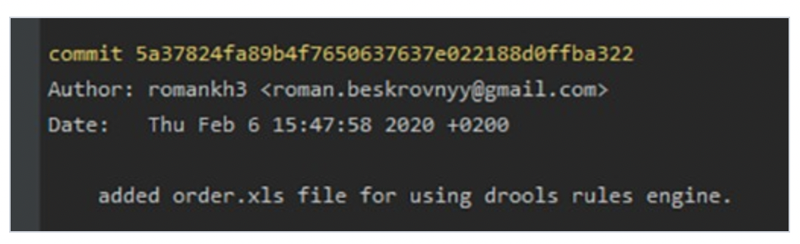

# Руководство по работе с Git'ом

Для того что бы начать полноценно работать с git, и допустим коллеги или заказчик смог увидеть кто делал коммиты и связаться с вами, желательно ему представиться, то есть указать автова коммитов. Для этого есть 2 команды:
+ git config --global user.name "<ваше_имя>". Данной командой указывается имя пользователя. Вместо <ваше_имя> пишем свое имя или никнейм. Важно: обязательно должны быть двойные ковычки "". 
Пример: git config --global user.name "Petr_Ivanov"
+ git config --global user.email "<адрес_почты@email.com>". Данной командой указывается ваша почта. Принцып тот же.
Пример: git config --global user.email "petrivanov1234@email.com"

## 1. Базовые команды git

Рассмотрим команды для создания репозитория, добавление файла для отслеживание, добавление коммитов. 
+ Создадим наш первый репозиторий. Для этого пройдите в папку вашего проекта. Затем в терминале вводим команду: git init. Теперь Git отслеживает изменения файлов вашего проекта

В папке создаем файл с любым расширение,принято работать в основном с текстовыми файлами. Например .txt или .md. 
+ Теперь нужно довать этот файл в git для его отслеживания. Используем команду git add <имя_файла>. Например: git add readme.txt
+ Настало время сделать первый коммит. Нам понадобиться команда git commit -m "<комментарий>". Пример git commit -m "Создали новый файл"

## 2. Особенности работы с репозиториями

При работе с нашим файлом мы переодически делаем сохраненни прогреса. Команда git status выводит текущий статут репозитория на момент последнего сохранения или других изменений. 
После сохранения нужно всегда добавлять файл в git для его отслеживания. 
После добавления файл в git можно сделать коммит. 
Не стоит после каждого изменения файла делать commit. Чаще всего их создают, когда:
+ Создан новый функционал
+ Добавлен новый блок на верстке
+ Исправлены ошибки по коду
+ Вы завершили рабочий день и хотите сохранить код

Это поможет держать вашу ветки в чистоте и порядке. Тем самым, вы будете видеть историю изменений по каждому нововведению в вашем проекте, а не по каждому файлу.

Если вы не до конца настроили систему для работы, в начале своего пути - не беда. Git всегда подскажет разработчику, если тот запутался, например:

+ Команда git --help - выводит общую документацию по git
+ Если введем git log --help - он предоставит нам документацию по какой-то определенной команде (в данном случае это - log)
+ Если вы вдруг сделали опечатку - система подскажет вам нужную команду
После выполнения любой команды - отчитается о том, что вы натворили
+ Также Гит прогнозирует дальнейшие варианты развития событий и всегда направит разработчика, не знающего, куда двигаться дальше

## 3. Перемещение между коммитами

Чтобы перейти к определенному коммиту, используйте команду git checkout, но checkout нужно указать номер коммита.

Один из способов номер коммита — просмотреть лог Git. Делается это при помощи команды git log. 

В первой строке каждого коммита после слова commit есть длинная строка букв и цифр: 94ab1fe28727…

Вот это и есть номер коммита. Это уникальный идентификатор, генерируемый для каждого коммита.

Чтобы перейти к определенному коммиту, вам нужно лишь передать его номер в качестве параметра команды git checkout:  git checkout 94ab1fe28727. 

__Примечание__ : обычно можно использовать всего несколько первых номера, потому что первые 4-5 символов скорее всего образуют уникальную комбинацию в рамках проекта.

## 4. Работа с ветками репозитория
Сначала нужно узнать сколько сейчас веток в нашем репозитории, этого воспользуемся командой git branch. 
+ Для создания новой ветки используется команда: git branch <имя новой ветки>. Пример: git branch NewDraft
+ Для удаления существующей ветки используется команда: git branch -d <имя новой ветки>. Пример: git branch -d NewDraft
+ Для слияния двух веток используется команда: git merge <имя ветки>. Пример: git merge NewDraft

## 5. Игнорирование файлов в Git
Зачастую нам не нужно, чтобы Git отслеживал все файлы в репозитории, потому что в их число могут входить:

+ файлы с чувствительной информацией вроде паролей;
+ большие бинарные файлы;
+ файлы сборок, которые генерируются после каждой компиляции;
+ файлы, специфичные для ОС/IDE, например, .DS_Store для macOS или .iml для IntelliJ IDEA — нам нужно, чтобы репозиторий как можно меньше зависел от системы.

Для игнорирования используется файл .gitignore. Чтобы отметить файлы, которые мы хотим игнорировать, можно использовать шаблоны поиска (считайте их упрощёнными регулярными выражениями):

+ /___ — позволяет избежать рекурсивности — соответствует файлам только в текущей директории;
+ __/ — соответствует всем файлам в указанной директории;
+ *___ — соответствует всем файлам с указанным окончанием;
+ ! — игнорирование файлов, попадающих под указанный шаблон;
+ [__] — соответствует любому символу из указанных в квадратных скобках;
+ ? — соответствует любому символу;
+ /**/ — соответствует вложенным директориям, например a/**/d соответствует a/d, a/b/d, a/b/c/d и т. д.

Мы даже можем использовать шаблоны поиска при указании файла/папки в других командах. Например, git add src/*.css добавит все файлы .css в папке src.

## 6. Работа с удалеными репозиториями 
Git относится к распределенным системам контроля версий. 
Распределенная система контроля версий – такая система, в которой участники хранят у себя на компьютере полную копию всех версий проекта. Такой принцип делает их независимыми от рабочего сервера.
 
Удаленный (иногда говорят "внешний") репозиторий – это версии вашего проекта, сохраненные на удаленном сервере. Доступ к репозиторию на таком сервере может осуществляться по интернету или по локальной сети. 
Удаленный репозиторий – полноценный репозиторий, ничем не отличающийся от локального. У удаленного репозитория есть собственные ветки, собственный указатель HEAD, своя история коммитов и так далее.

Если мы подключим удаленный репозиторий к своему локальному, то у нас появятся копии всех ссылочных объектов удаленного репозитория. То есть, например, у удаленного репозитория есть ветка main, а у нас будет копия этой ветки – origin/main. Все такие ссылочные объекты (указатели, ветки и теги) удаленного репозитория хранятся почти там же, где и у локального – в директории .git/refs/remotes/<имя_удаленного_репозитория>. 

# Добавление удаленного репозитория к существующему локальному. Команда git remote add. 
Имя удаленного репозитория в команде git remote add вы можете придумать сами. Впоследствии, при работе с этим удаленным репозиторием, вы будете обращаться к нему по придуманному имени. Принято называть удаленный репозиторий origin, но строго говоря, никаких ограничений здесь нет. 

Со ссылкой на удаленный репозиторий тоже все просто. Мы работаем с GitHub, поэтому эту ссылку можно взять, нажав на большую зеленую кнопку Code на странице репозитория на GitHub.

Иногда возникает необходимость забыть удаленный репозиторий. Для этого существует команда git remote remove. 
Данная команда предельно проста в использовании. В качестве имени репозитория нужно передавать то имя, которое вы указывали в команде git remote add. Заметьте, данная команда не удаляет удаленный репозиторий с сервера, она удаляет только подключение вашего репозитория к удаленному. 

# Клонирование удаленного репозитория. 
Команда git clone.  
Необходимость клонировать существующий удаленный репозиторий возникает в ситуациях, когда вы решаете поработать над уже существующим кодом. Для выполнения этой операции в Git предусмотрена команда git clone. 
Ссылку на удаленный репозиторий можно получить тем же способом, что мы разбирали выше. Нужно нажать на зеленую кнопку Code на главной странице репозитория на GitHub.
Давайте на примере разберем, как происходит клонирование. Клонируем уже знакомый нам репозиторий geometric_lib. При выполнении команды git сlone https://github.com/smartiqaorg/geometric_lib.git произойдет следующее:

1. В директории, откуда вы запустили команду git clone, создается директория с именем репозитория. В нашем случае, если мы выполнили команду из директории пользователя, будет создана папка C:\users\smartiqa\geometric_lib\.
2. В созданную директорию копируется репозиторий, все его ветки и коммиты.
В новосозданный локальный репозиторий добавляется удаленный репозиторий с именем origin и ссылкой, которую мы передавали в git clone. Это избавляет нас от необходимости вручную писать git remote add origin https://github.com/smartiqaorg/geometric_lib.git. На этом процесс клонирования заканчивается.

# Отправка изменений в удалённый репозиторий

Отправлять изменения в удалённый репозиторий можно параметром push с указанием имени репозитория и ветки.

    git push origin main
Эта команда передаёт локальные изменения в центральный репозиторий, где с ними могут ознакомиться другие участники проекта.

 # Получение изменений из удалённого репозитория

Для загрузки изменений из удалённого репозитория используется параметр pull. Он скачивает копию текущей ветки с указанного удалённого репозитория и объединяет её с локальной копией.

    git pull
Также можно просмотреть подробные сведения о загруженных файлах с помощью флага --verbose.

    git pull --verbose
    
